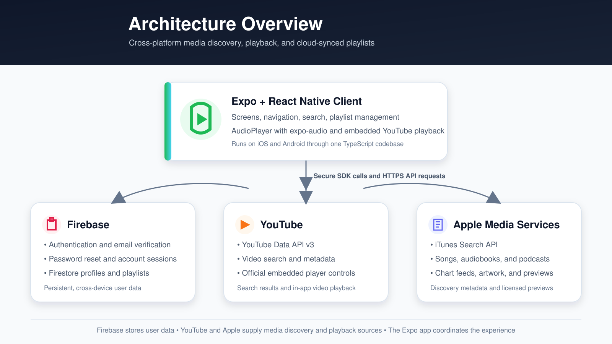

# PlayList


PlayList is a cross-platform media discovery and playlist application built with Expo and React Native. Users can discover songs, podcasts, audiobooks, and YouTube videos, preview supported media, and organize different media types into cloud-synced playlists.

This project began as a class project and was expanded afterward with stronger authentication, Firestore synchronization, richer media discovery, improved playback controls, and a more polished mobile experience.

## How it works

1. A user creates an account with an email address and password.
2. Firebase sends an email-verification link.
3. After verifying the email, the user can sign in.
4. The user can browse or search for songs, podcasts, audiobooks, and videos.
5. Playable previews and YouTube videos can be opened in the app's media player.
6. Media can be added to a new or existing playlist.
7. Playlists are stored in Cloud Firestore and remain available when the user signs in on another device.

## Features

- Email/password registration and sign-in
- Email verification and password reset
- User-specific Firestore data protected by security rules
- Cross-device playlist synchronization
- Discovery and search across multiple media types
- Top-song and top-podcast views with API fallbacks
- Podcast category filtering and episode browsing
- Audio preview playback with play, pause, previous, next, automatic advancement, and seek controls
- Embedded YouTube playback inside playlists
- Mixed-media playlists containing songs, audiobooks, podcast episodes, and videos
- Sequential and shuffled playlist playback
- Duplicate-item feedback and playlist-management notifications
- Source attribution and links back to Apple services
- Responsive mobile layouts and reusable search/player components

## Technology stack

| Area | Technology | Purpose |
| --- | --- | --- |
| Mobile application | Expo, React Native, TypeScript | Cross-platform application development |
| Navigation | React Navigation | Stack and bottom-tab navigation |
| Authentication | Firebase Authentication | Account creation, sign-in, verification, and password reset |
| Database | Cloud Firestore | Persistent user profiles and cross-device playlist synchronization |
| Audio | `expo-audio` | Audio preview playback, progress tracking, and seeking |
| Video | `react-native-youtube-iframe` | Embedded YouTube playback using official player controls |
| Media discovery | Apple iTunes Search API | Song, audiobook, podcast, and episode metadata and preview URLs |
| Charts | Apple RSS/Marketing Tools feeds | Top-song and top-podcast discovery |
| Video discovery | YouTube Data API v3 | Video search, thumbnails, and metadata |
| UI | Expo Vector Icons, React Native components | Consistent controls and mobile interface |

## Architecture



The Expo application acts as the client and coordinates three external service groups:

- **Firebase** authenticates users and stores user-owned profile and playlist data.
- **YouTube** supplies searchable video metadata through the Data API and playback through the embedded player.
- **Apple media services** supply searchable metadata, artwork, chart information, external store links, and preview URLs.

Media data is normalized into a shared model so songs, audiobooks, podcast episodes, and videos can coexist in the same playlist. Playback is coordinated through a shared player to prevent multiple audio sources from playing simultaneously.

## Media Attribution and Limitations

PlayList is a discovery and playlist-management project, not a licensed full-catalog streaming service.

- Apple-provided audio is limited to the previews made available by Apple.
- Some chart entries may not have an available preview.
- Podcast availability depends on the metadata and episode URLs returned by Apple.
- YouTube videos remain hosted and controlled by YouTube and their respective owners.
- Upstream APIs can occasionally return rate-limit errors, timeouts, or temporary service errors. The application uses fallback searches where practical.
- Source links and attribution direct users to the relevant Apple or YouTube service.

## Learning outcomes

This project demonstrates:

- Building a multi-screen mobile application with React Native and TypeScript
- Integrating multiple third-party APIs with different response formats
- Designing a normalized data model for mixed media
- Implementing authentication and user-scoped cloud persistence
- Writing and reasoning about Firestore Security Rules
- Coordinating audio and video playback lifecycle across navigation screens
- Handling asynchronous loading, empty, error, and fallback states
- Managing environment configuration without committing local values
- Iterating on usability issues discovered through simulator testing
- Balancing technical capability with API licensing and platform limitations

## 🎥 Demo

[Watch the PlayList Demo](https://drive.google.com/file/d/1wG-nJruzQhfre75ax-5c5MV62Yhq62CQ/view?usp=sharing)


## Running the Project

### Prerequisites

Install or create the following before running the application:

- Node.js and npm
- Expo Go on a physical mobile device, or an iOS/Android simulator
- A Firebase project
- A Cloud Firestore database
- A YouTube Data API v3 key

### 1. Clone the repository

```bash
git clone https://github.com/erikamanley451/playlist.git
cd playlist
```

### 2. Install dependencies

```bash
npm install
```

### 3. Configure environment variables

Copy the example environment file:

```bash
cp .env.example .env
```

Add the appropriate client configuration values to `.env`:

```env
EXPO_PUBLIC_FIREBASE_API_KEY=
EXPO_PUBLIC_FIREBASE_AUTH_DOMAIN=
EXPO_PUBLIC_FIREBASE_PROJECT_ID=
EXPO_PUBLIC_FIREBASE_STORAGE_BUCKET=
EXPO_PUBLIC_FIREBASE_MESSAGING_SENDER_ID=
EXPO_PUBLIC_FIREBASE_APP_ID=

EXPO_PUBLIC_YOUTUBE_API_KEY=
```


### 4. Configure Firebase Authentication

In the Firebase console:

1. Open **Authentication**.
2. Select **Sign-in method**.
3. Enable **Email/Password** authentication.
4. Confirm that your email templates are configured for email verification and password reset.

### 5. Create and secure Cloud Firestore

Create a Firestore database in the Firebase console, then publish rules that restrict each user to their own profile and playlists. The project includes a `firestore.rules` file similar to the following:

```text
rules_version = '2';

service cloud.firestore {
  match /databases/{database}/documents {
    function ownsData(userId) {
      return request.auth != null
        && request.auth.uid == userId;
    }

    match /users/{userId} {
      allow create, read, update, delete:
        if ownsData(userId);

      match /playlists/{playlistId} {
        allow read, write:
          if ownsData(userId);
      }
    }
  }
}
```

These rules can be pasted into **Firestore Database → Rules** in the Firebase console and published.

### 6. Configure YouTube

In Google Cloud Console:

1. Enable **YouTube Data API v3** for your project.
2. Create an API key.
3. Add the key to `EXPO_PUBLIC_YOUTUBE_API_KEY` in `.env`.
4. Apply appropriate API restrictions before deploying the application.

### 7. Start the Expo development server

```bash
npx expo start
```

Then choose one of the following:

- Scan the QR code with Expo Go on a mobile device.
- Press `i` to open the iOS Simulator on macOS.
- Press `a` to open an available Android emulator.

If Metro appears to be using stale code, restart it with:

```bash
npx expo start --clear
```

### Project status

PlayList is an educational portfolio project. It is not affiliated with, endorsed by, or sponsored by Apple, YouTube, Google, or Firebase. All third-party names, artwork, metadata, previews, and playback services belong to their respective owners.
